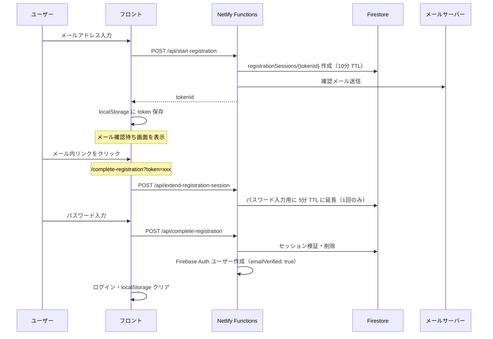

# ミニメモ

優先度と締切を設定できる、シンプルなメモ管理アプリです。  
Firebase 認証・Firestore でユーザーごとにデータを同期し、PWA 対応のためスマートフォンにインストールしてオフラインでも利用できます。

## 主な機能

- **優先度別メモ管理** — 高・中・低の3段階でメモを分類
- **締切タイマー** — 残り時間をリアルタイム表示（締切間近は警告表示）
- **メモの追加・編集・削除**
- **期限切れメモの自動削除** — 設定で ON/OFF 切り替え可能（Firestore に保存）
- **セキュアな新規登録フロー** — メール確認完了後にのみ Firebase Auth ユーザーを作成（詳細は [認証フロー](#認証フロー)）
- **独自メール送信** — Netlify Functions + SMTP で確認メールを送信（Firebase 標準メールに依存しない）
- **クラウド同期** — メモ・設定を Firestore に保存（ログインユーザーごとに分離）
- **オフライン対応** — Firestore のローカルキャッシュ（IndexedDB）でオフライン時も閲覧・操作可能
- **PWA** — ホーム画面への追加・スタンドアロン表示に対応

## 技術スタック

### コア

| ライブラリ | 用途 |
|-----------|------|
| [React](https://react.dev/) 19 | UI フレームワーク |
| [Vite](https://vite.dev/) 7 | ビルドツール・開発サーバー |
| [React Router](https://reactrouter.com/) 7 | ページルーティング |

### バックエンド（Firebase）

| サービス | 用途 |
|---------|------|
| [Firebase Authentication](https://firebase.google.com/docs/auth) | メール / パスワード認証 |
| [Cloud Firestore](https://firebase.google.com/docs/firestore) | メモ・ユーザー設定・仮登録セッションの保存 |
| [Firebase Storage](https://firebase.google.com/docs/storage) | 将来のファイル保存用（ルール定義済み） |
| [Firebase Analytics](https://firebase.google.com/docs/analytics) | 画面遷移のトラッキング |

### サーバー（Netlify Functions）

| ライブラリ / サービス | 用途 |
|---------------------|------|
| [Netlify Functions](https://docs.netlify.com/functions/overview/) | 新規登録 API・メール送信 |
| [firebase-admin](https://firebase.google.com/docs/admin/setup) | サーバー側でのユーザー作成・トークン管理 |
| [nodemailer](https://nodemailer.com/) | SMTP 経由の確認メール送信 |

### 状態管理

| ライブラリ | 用途 |
|-----------|------|
| [Zustand](https://zustand.docs.pmnd.rs/) | メモデータの UI キャッシュ（Firestore と `onSnapshot` で同期） |
| [Jotai](https://jotai.org/) | 自動削除設定など UI 状態（Firestore の設定を反映） |

### その他

| ライブラリ | 用途 |
|-----------|------|
| [vite-plugin-pwa](https://vite-pwa-org.netlify.app/) | PWA 対応（マニフェスト・Service Worker） |

### 開発ツール

| ライブラリ | 用途 |
|-----------|------|
| [Biome](https://biomejs.dev/) | フォーマット・Lint |
| [@vitejs/plugin-react](https://github.com/vitejs/vite-plugin-react) | React Fast Refresh 対応 |
| [netlify-cli](https://docs.netlify.com/cli/get-started/) | ローカルでの Functions 動作確認 |

## セットアップ

### 必要環境

- Node.js **22.15.1** 以上（`.nvmrc` 参照）
- Firebase プロジェクト（Authentication・Firestore を有効化）
- メール送信用 SMTP（Gmail アプリパスワードなど）

```bash
# nvm を使っている場合
nvm use
```

### 環境変数

`.env.example` をコピーして `.env` を作成し、値を入力します。

```bash
cp .env.example .env   # Windows の場合は手動でコピー
```

#### フロントエンド（`VITE_` プレフィックス）

| 変数名 | 説明 |
|--------|------|
| `VITE_FIREBASE_API_KEY` | Web API キー |
| `VITE_FIREBASE_AUTH_DOMAIN` | Auth ドメイン |
| `VITE_FIREBASE_PROJECT_ID` | プロジェクト ID |
| `VITE_FIREBASE_STORAGE_BUCKET` | Storage バケット |
| `VITE_FIREBASE_MESSAGING_SENDER_ID` | Messaging Sender ID |
| `VITE_FIREBASE_APP_ID` | App ID |

#### サーバー（Netlify Functions）

| 変数名 | 説明 |
|--------|------|
| `FIREBASE_API_KEY` | トークン検証用（`VITE_FIREBASE_API_KEY` と同じ値） |
| `FIREBASE_PROJECT_ID` | Firebase Admin 用プロジェクト ID |
| `FIREBASE_CLIENT_EMAIL` | サービスアカウントのメールアドレス |
| `FIREBASE_PRIVATE_KEY` | サービスアカウントの秘密鍵 |
| `APP_URL` | 確認メール内リンクの戻り先（ローカル: `http://localhost:8888`） |
| `SMTP_HOST` / `SMTP_PORT` / `SMTP_SECURE` | SMTP サーバー設定 |
| `SMTP_USER` / `SMTP_PASS` | SMTP 認証情報 |
| `MAIL_FROM` | 送信元メールアドレス |

本番デプロイ（Netlify）では、上記を Netlify の環境変数に設定してください。

### インストール & 起動

```bash
# 依存パッケージのインストール
npm install

# フロントのみ（http://localhost:5173）
npm run dev

# フロント + Netlify Functions（新規登録・メール送信の動作確認用）
# → http://localhost:8888 でアクセス
npm run dev:netlify
```

新規登録フローやメール送信を試す場合は **`npm run dev:netlify`** を使ってください。  
`npm run dev` だけでは `/api/*` の Functions が動かないため、登録 API は 404 になります。

スマートフォンから同じ Wi-Fi 経由でアクセスする場合、開発サーバーは LAN 上の IP でも接続可能です（`vite.config.js` の `server.host: true` 設定）。

### その他のコマンド

```bash
npm run build         # 本番ビルド
npm run preview       # ビルド結果のプレビュー
npm run lint          # Biome で Lint + フォーマットチェック
npm run lint:fix      # Biome で自動修正
npm run format        # フォーマットのみ適用
npm run format:check  # フォーマットチェックのみ
```

## Firebase のデプロイ

Firestore ルール・インデックス・Storage ルールは `firebase/` フォルダで管理しています。  
プロジェクト ID は `firebase/.firebaserc` で指定されています。

```bash
cd firebase

# Firestore ルール・インデックス、Storage ルールをデプロイ
firebase deploy --only firestore,storage
```

`registrationSessions` コレクションの読み取りルールも含まれます。新規登録フローを使う前に必ずデプロイしてください。

### Firestore データ構造

```
registrationSessions/{tokenId}   # 仮登録セッション（サーバー書き込み・クライアント読み取りのみ）
  email, createdAt, expiresAt, passwordWindowStarted

users/{userId}/
├── memos/{memoId}               # メモ（title, content, deadline, priority）
└── settings/app                 # ユーザー設定（autoDelete: boolean）
```

`registrationSessions` はクライアントからの書き込みを禁止し、有効期限の監視（`onSnapshot`）のみ許可しています。

## プロジェクト構成

```
.
├── firebase/
│   ├── client/              # Auth / Firestore / Analytics / 登録フローのクライアント API
│   ├── config.js            # Firebase 初期化（オフラインキャッシュ含む）
│   ├── firestore.rules      # Firestore セキュリティルール
│   ├── storage.rules        # Storage セキュリティルール
│   └── firebase.json        # Firebase CLI 設定
├── netlify/
│   └── functions/           # Netlify Functions（新規登録 API・メール送信）
│       ├── start-registration.js
│       ├── extend-registration-session.js
│       ├── complete-registration.js
│       └── utils/           # SMTP・メールテンプレート・仮トークン管理
├── src/
│   ├── api/                 # フロントから Functions への HTTP クライアント
│   ├── atom/                # Jotai の atom 定義
│   ├── components/
│   │   ├── layout/          # Header, Footer, 認証レイアウト
│   │   └── ui/              # ボタン・リストなど再利用 UI
│   ├── constants/           # フッタータブ・localStorage キーなど
│   ├── context/auth/        # 認証コンテキスト（AuthProvider）
│   ├── hooks/               # Firestore 同期・フィルターなどのカスタムフック
│   ├── pages/               # 各画面コンポーネント
│   │   └── Auth/            # ログイン・新規登録・メール確認待ち・パスワード設定
│   ├── store/               # Zustand ストア（メモの UI キャッシュ）
│   └── units/               # 日付・メモ関連のユーティリティ
├── public/_redirects        # SPA ルーティング + /api/* → Functions
├── netlify.toml             # Netlify ビルド・Functions 設定
├── biome.json               # Biome 設定
└── jsconfig.json            # パスエイリアス（@/ → src/）
```

`@/` エイリアスは `jsconfig.json`（エディタ補完）と `vite.config.js`（ビルド）の両方で設定されています。

## 画面一覧

| パス | 画面 | 説明 |
|------|------|------|
| `/` | 締切 | 締切が近いメモを優先度フィルター付きで一覧表示 |
| `/deadline` | — | `/` へリダイレクト |
| `/memo` | メモホーム | 優先度の選択・自動削除設定 |
| `/memoList` | メモ一覧 | 選択した優先度のメモ一覧 |
| `/memoData` | メモ詳細 | メモの内容確認・編集 |
| `/addMemo` | メモ追加 | 新規メモの作成 |
| `/complete-registration` | パスワード設定 | 確認メールのリンクから遷移（`?token=xxx`） |

未ログイン時はログイン画面、仮登録途中（localStorage にトークンあり）ならメール確認待ち画面が表示されます。  
ログイン済みでメール未認証の場合は、従来の確認メール案内画面が表示されます（レガシーユーザー向け）。

## 認証フロー

### 設計のポイント

通常の Firebase 新規登録とは異なり、**メール確認が完了するまで Firebase Auth にユーザーを作成しません**。

- 仮トークンを Firestore の `registrationSessions` に保存（有効期限付き）
- 確認メールは Netlify Functions + SMTP で独自送信
- メールリンクを開いてパスワード設定後、`admin.auth().createUser({ emailVerified: true })` で本登録
- フロントは Firestore を `onSnapshot` で監視し、期限切れをリアルタイム検知

### 新規登録の流れ



### API エンドポイント

| エンドポイント | 処理 |
|---------------|------|
| `POST /api/start-registration` | 仮トークン作成・確認メール送信 |
| `POST /api/extend-registration-session` | パスワード設定画面を開いたとき TTL を 5 分にリセット |
| `POST /api/complete-registration` | トークン検証 → Firebase Auth ユーザー作成 |

### 有効期限

| フェーズ | 期限 |
|---------|------|
| メール確認待ち | 10 分（`REGISTRATION_SESSION_TTL_MS`） |
| パスワード設定 | リンクを開いてから 5 分（`PASSWORD_ENTRY_TTL_MS`、1 回のみ延長） |

### ログイン

既存ユーザーはメールアドレス / パスワードでログインします。  
ログイン後は Firestore からメモ・設定をリアルタイム同期します。
